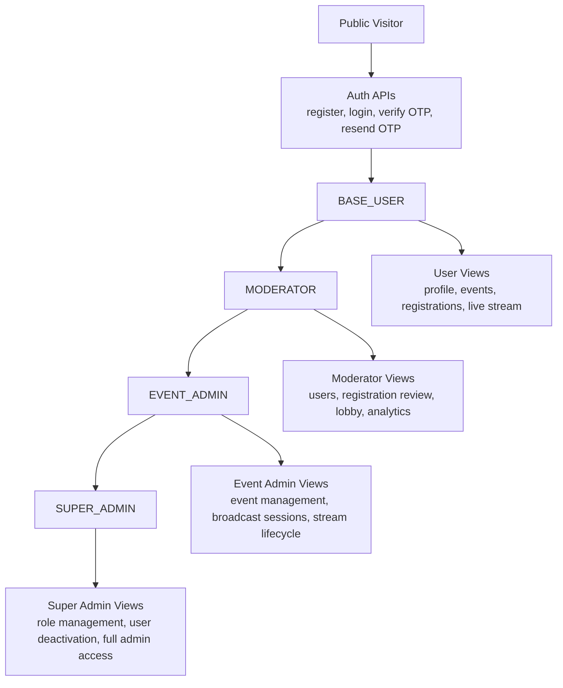
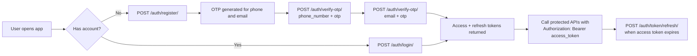
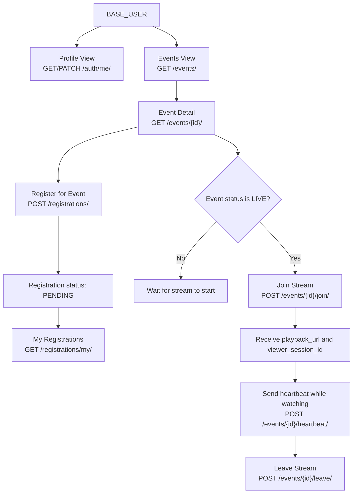
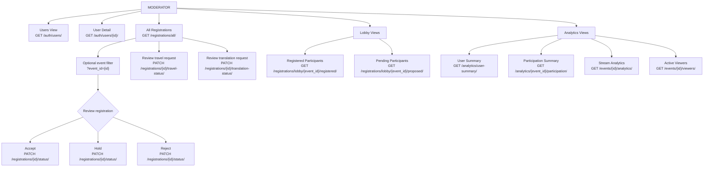
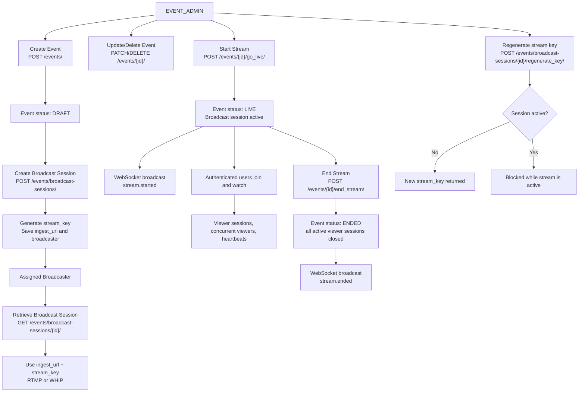
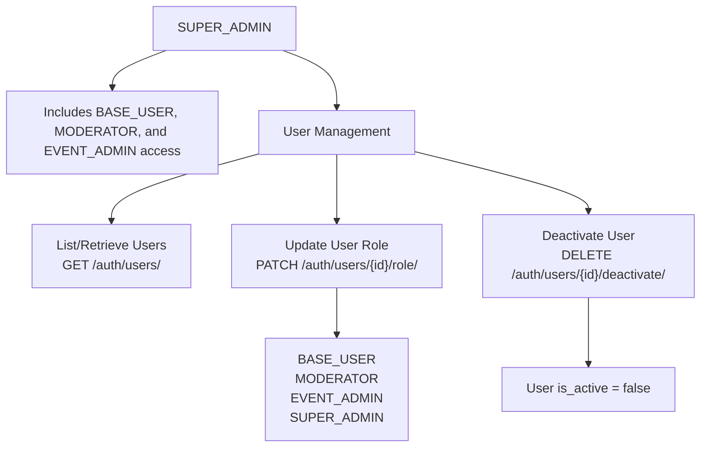
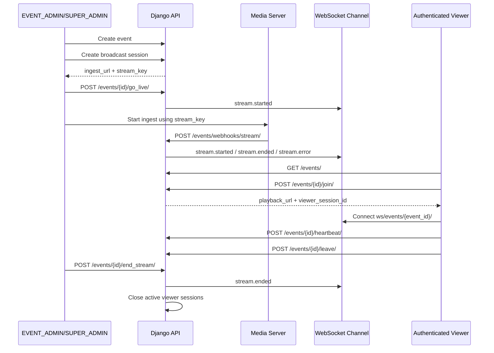

# CSTEP Backend User-Wise Workflow

This workflow is based on the Django REST Framework views, URL routes, and permission classes in the project.

## Role Access Overview

## Shared Authentication Flow

## BASE_USER View Workflow

## MODERATOR View Workflow

## EVENT_ADMIN View Workflow

## SUPER_ADMIN View Workflow

## Live Stream System Workflow

## View-To-Role Matrix

| View Area | BASE_USER | MODERATOR | EVENT_ADMIN | SUPER_ADMIN |
|---|---:|---:|---:|---:|
| Register, verify OTP, login | Yes | Yes | Yes | Yes |
| Own profile | Yes | Yes | Yes | Yes |
| List/detail events | Yes | Yes | Yes | Yes |
| Register for event | Yes | Yes | Yes | Yes |
| Join/live heartbeat/leave stream | Yes | Yes | Yes | Yes |
| List/retrieve users | No | Yes | Yes | Yes |
| Review registrations | No | Yes | Yes | Yes |
| Lobby views | No | Yes | Yes | Yes |
| Analytics | No | Yes | Yes | Yes |
| Create events | No | No | Yes | Yes |
| Manage events | No | Creator/object access only | Yes | Yes |
| Create/manage broadcast sessions | No | No | Yes | Yes |
| Update user roles | No | No | No | Yes |
| Deactivate users | No | No | No | Yes |
